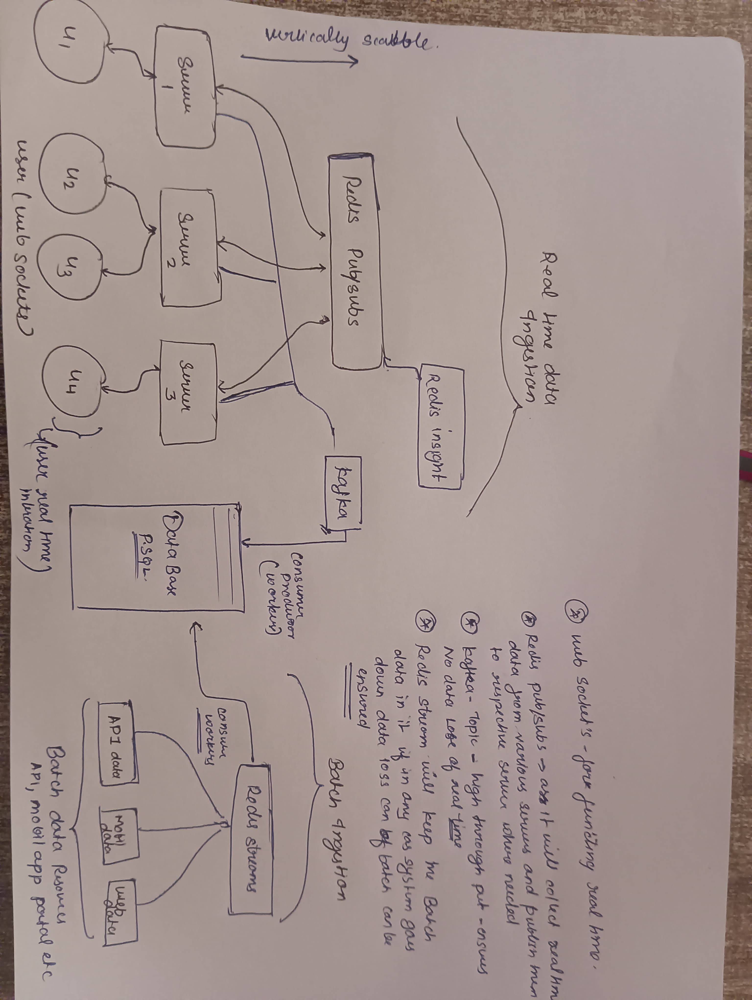

# Unified Ingestion Architecture (V2)

This updated diagram provides a clearer view of both **real-time** and **batch** data ingestion pipelines.

## Key Components

1. **WebSockets** – for real-time data flow to users.
2. **Redis Pub/Sub** – collects real-time data from sources and routes them to appropriate servers.
3. **Kafka Topics** – ensures high-throughput and avoids real-time data loss.
4. **Redis Insight** – for monitoring data flows.
5. **Redis Streams** – buffers batch data ingestion from various APIs, mobile apps, etc., ensuring durability and backpressure handling.

Both systems ultimately write to a **PostgreSQL database** through worker consumers.

